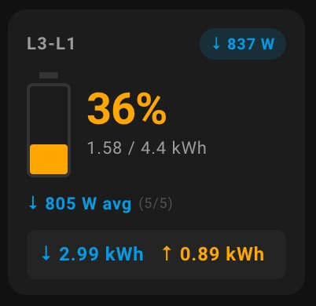
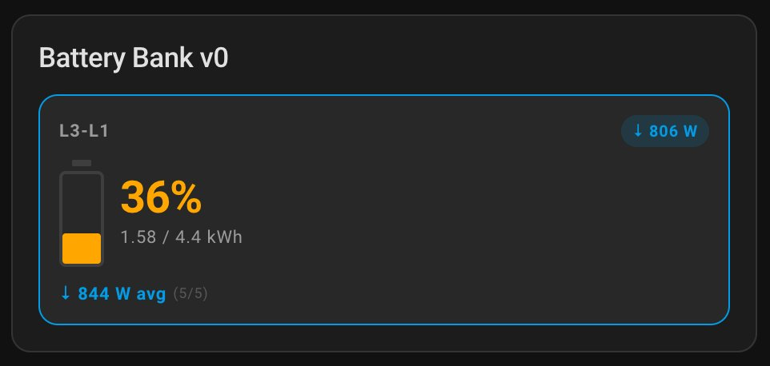
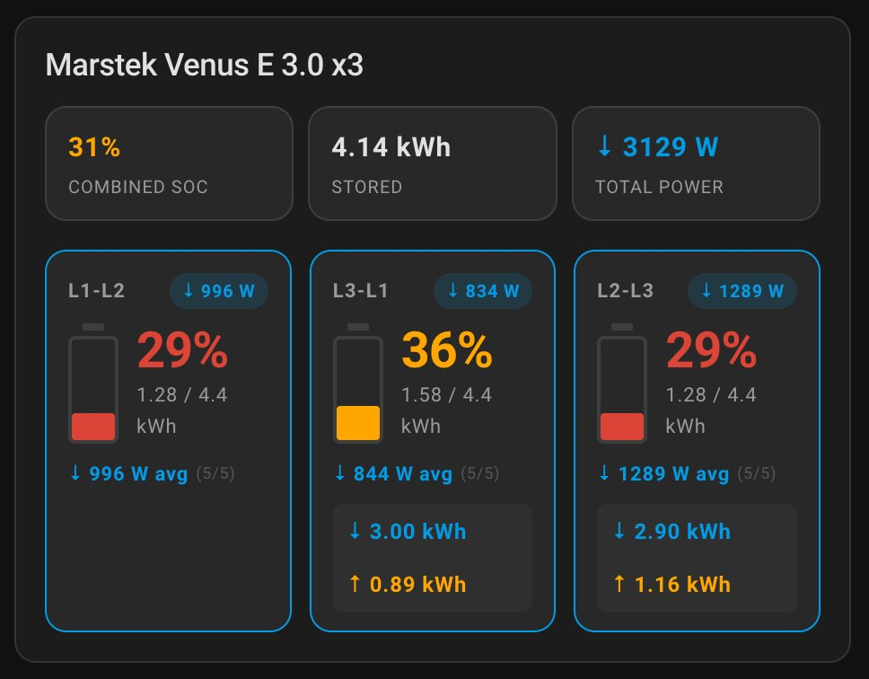
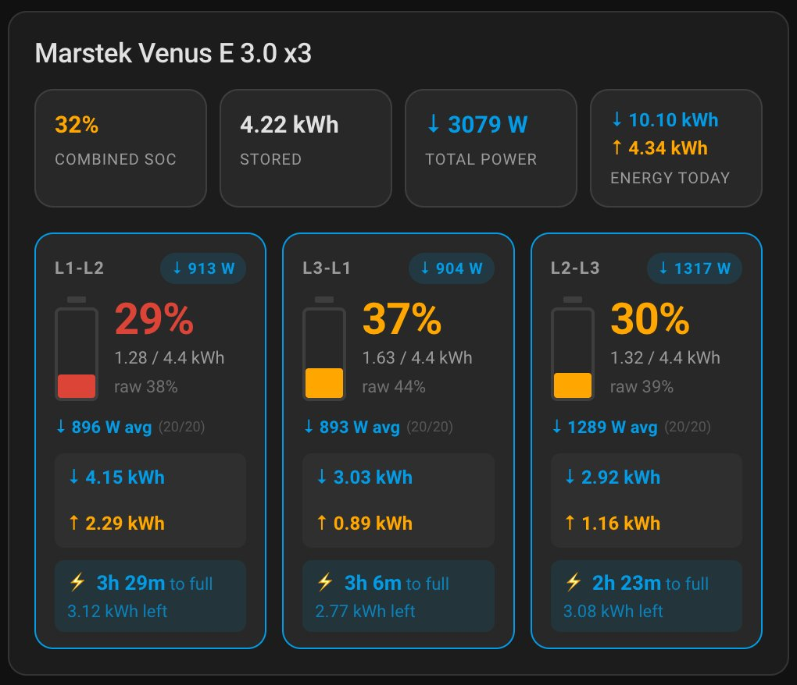

# Battery Bank Card

A custom [Home Assistant](https://www.home-assistant.io/) Lovelace card for monitoring a bank of 1–6 batteries with real-time power, rolling average, time-to-full/empty projections, and daily energy totals.

[](https://github.com/hacs/integration)

---

## Screenshots

### Single battery — no title (solo mode)


### Single battery — with title


### Three batteries


### Three batteries — with energy today and predictions


---

## Features

- **1 to 6 batteries** in a responsive grid
- **Battery icon** with animated SoC fill, colour-coded green → amber → red
- **Power pill** per battery — blue (charging ↓) / orange (discharging ↑) / grey (idle)
- **Rolling average** of the last N power readings (configurable, default 5)
- **Time-to-full / time-to-empty** predictions (toggleable)
- **Daily energy** — charged ↓ and discharged ↑ kWh per battery and combined total
- **Combined SoC tile** — calculated automatically, or linked to your own entity (clickable → more-info)
- **SoC floor support** — raw sensor (e.g. 12–100%) or pre-converted usable SoC
- **Solo mode** — single battery with no title renders flush inside the card with no inner box
- **Summary row** — combined SoC %, total stored kWh, total power, energy today (2+ batteries only)
- **Stale detection** — red border + warning when the power entity reports `unknown`, `unavailable`, `none` or an empty/non-numeric value
- **Visual config editor** with native HA entity pickers and form controls
- Throttled DOM updates — redraws at most once per 125 ms, data collected at full speed

---

## Installation

### HACS (recommended)

1. Open HACS in your Home Assistant instance
2. Go to **Frontend**
3. Click the ⋮ menu → **Custom repositories**
4. Add `https://github.com/filipvh/battery-bank-card` as category **Dashboard**
5. Search for **Battery Bank Card** and install
6. Reload your browser

### Manual

1. Download `battery-bank-card.js` from the [latest release](https://github.com/filipvh/battery-bank-card/releases/latest)
2. Copy to `config/www/battery-bank-card.js`
3. Go to **Settings → Dashboards → ⋮ → Resources** and add:
   - URL: `/local/battery-bank-card.js`
   - Type: **JavaScript module**
4. Reload your browser

---

## Configuration

Add via the visual editor, or use YAML:

```yaml
type: custom:battery-bank-card
title: Marstek Venus E 3.0 x3    # optional
entity_combined_soc: sensor.marstek_combined_soc  # optional — see below
avg_count: 5                      # optional, 2–20, default 5
show_predictions: true            # optional, default true
show_raw_soc: false               # optional, default false
batteries:
  - name: L1-L2
    entity_soc:         sensor.marstek_battery_1_usable_soc
    entity_power:       sensor.marstek_venus_e_v3_0_1_battery_power
    soc_floor:          12        # optional — set if entity reports raw SoC (e.g. 12–100%)
    capacity_kwh:       4.4       # total physical capacity if floor > 0, usable if floor = 0
    entity_energy_in:   sensor.marstek_venus_e_v3_0_1_battery_charge_today    # optional
    entity_energy_out:  sensor.marstek_venus_e_v3_0_1_battery_discharge_today # optional
```

### Card options

| Option | Default | Description |
|---|---|---|
| `title` | — | Card header. Omit for no header. With a single battery and no title, the tile fills the card directly (solo mode). |
| `entity_combined_soc` | — | **Optional.** An entity reporting the combined SoC % of the battery bank. If provided, its value is shown in the summary tile and clicking the tile opens the entity's more-info dialog. If omitted, combined SoC is calculated from the individual battery values weighted by capacity. |
| `avg_count` | `5` | Number of power readings for the rolling average and predictions. Range 2–20. A reading is added whenever the sensor value changes, and also re-fed every 15 seconds if the value stays constant, so the average stays current when the power sits at a flat value (e.g. 0 W). |
| `show_predictions` | `true` | Show time-to-full / time-to-empty block per battery. |
| `show_raw_soc` | `false` | Show raw SoC % from the entity alongside the converted usable %. Only meaningful when `soc_floor > 0`. |

### Battery options

| Option | Required | Description |
|---|---|---|
| `entity_soc` | ✅ | Entity reporting battery state of charge in % |
| `entity_power` | ✅ | Entity reporting power in watts — **negative = charging, positive = discharging** |
| `capacity_kwh` | ✅ | Battery capacity in kWh — see SoC floor section below |
| `name` | — | Tile label. Defaults to `Battery N`. |
| `soc_floor` | — | Physical empty threshold in % (default 0) — see below |
| `entity_energy_in` | — | Entity reporting kWh charged today |
| `entity_energy_out` | — | Entity reporting kWh discharged today |

---

## Combined SoC tile

The summary row always shows a **Combined SoC** tile. By default its value is calculated from the individual battery SoC sensors, weighted by usable capacity:

```
combined % = total stored kWh / total usable capacity kWh × 100
```

If your integration exposes its own combined SoC sensor (for example a Marstek or Victron system sensor), you can link it with `entity_combined_soc`. When set:

- The tile displays the value from your entity instead of the calculated figure
- The tile becomes **clickable** — tapping it opens the entity's more-info dialog
- The entity is included in change detection, so the card updates whenever its value changes

```yaml
entity_combined_soc: sensor.marstek_global_battery_soc
```

---

## SoC floor

**`soc_floor: 0` (default)** — the entity already reports 0–100% usable SoC. Set `capacity_kwh` to the usable capacity.

**`soc_floor > 0`** — the entity reports raw physical SoC (e.g. 12–100%). Set `capacity_kwh` to the total physical capacity. The card converts internally:

```
usable % = (raw % − floor) / (100 − floor) × 100
usable kWh = capacity_kwh × (100 − floor) / 100
```

Example — Marstek battery where 12% is the physical empty point:

```yaml
- entity_soc:   sensor.marstek_venus_e_v3_0_1_battery_soc   # reports 12–100%
  entity_power: sensor.marstek_venus_e_v3_0_1_battery_power
  soc_floor:    12
  capacity_kwh: 5.0    # total physical — card shows 4.4 kWh usable
```

---

## Daily energy totals

If `entity_energy_in` and `entity_energy_out` are configured for **all** batteries, the card shows:
- Per-battery charged/discharged kWh in each tile
- A combined **Energy today** tile in the summary row

If any battery is missing either entity, or if either sensor is unavailable, the combined tile is hidden to avoid showing misleading totals.

---

## Power convention

| Value | Meaning | Display |
|---|---|---|
| `< −5 W` | Charging | Blue ↓ |
| `> +5 W` | Discharging | Orange ↑ |
| `−5 to +5 W` | Idle | Grey ~ |

---

## Full example

```yaml
type: custom:battery-bank-card
title: Marstek Venus E 3.0 x3
entity_combined_soc: sensor.marstek_global_battery_soc
avg_count: 20
show_predictions: true
show_raw_soc: true
batteries:
  - name: L1-L2
    entity_soc:         sensor.marstek_venus_e_v3_0_1_battery_soc
    entity_power:       sensor.marstek_venus_e_v3_0_1_battery_power
    entity_energy_in:   sensor.marstek_venus_e_v3_0_1_battery_charge_today
    entity_energy_out:  sensor.marstek_venus_e_v3_0_1_battery_discharge_today
    soc_floor:    12
    capacity_kwh: 5.0
  - name: L3-L1
    entity_soc:         sensor.marstek_venus_e_v3_0_2_battery_soc
    entity_power:       sensor.marstek_venus_e_v3_0_2_battery_power
    entity_energy_in:   sensor.marstek_venus_e_v3_0_2_battery_charge_today
    entity_energy_out:  sensor.marstek_venus_e_v3_0_2_battery_discharge_today
    soc_floor:    12
    capacity_kwh: 5.0
  - name: L2-L3
    entity_soc:         sensor.marstek_venus_e_v3_0_3_battery_soc
    entity_power:       sensor.marstek_venus_e_v3_0_3_battery_power
    entity_energy_in:   sensor.marstek_venus_e_v3_0_3_battery_charge_today
    entity_energy_out:  sensor.marstek_venus_e_v3_0_3_battery_discharge_today
    soc_floor:    12
    capacity_kwh: 5.0
```

---

## GitHub repository setup

After pushing, set the following on your GitHub repo to make it discoverable in HACS:

- **Description**: Multi-battery Lovelace card for Home Assistant with power averaging, predictions and daily energy totals
- **Topics**: `home-assistant`, `hacs`, `lovelace`, `lovelace-card`, `lovelace-custom-card`, `battery`

To submit to the default HACS store, see [hacs.xyz/docs/publish/include](https://www.hacs.xyz/docs/publish/include/).
